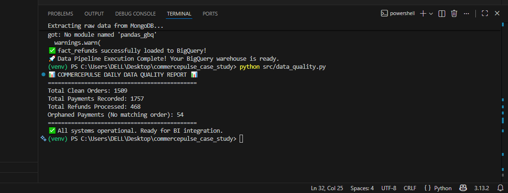

# CommercePulse Analytics Pipeline

## Overview
CommercePulse is a rapidly growing e-commerce aggregation platform operating across multiple African markets. This pipeline solves a critical data infrastructure challenge: combining highly irregular **historical batch exports** from early operations with high-velocity **live event streams** into a single, unified analytics system.

The pipeline delivers trustworthy daily analytics on revenue and payment patterns while elegantly handling real-world chaos like schema drift, duplicate payloads, and late-arriving events.

## Architecture 
* **MongoDB (Raw Landing Zone):** Stores all historical and live events exactly as received. Serves as the immutable system of record and audit trail.
* **Pandas (Transformation Layer):** Acts as an in-memory reconciliation engine to normalize severe vendor schema drift, enforce business logic, and flatten nested JSON.
* **Google Cloud BigQuery (Analytics Warehouse):** Provides clean, strictly-typed fact and dimension tables optimized for high-performance BI reporting.

## Project Structure
    commercepulse_case_study/
    ├── .env                    # Environment variables (Untracked)
    ├── .gitignore              # Security rules
    ├── data/
    │   ├── fx_rates_2023.csv
    │   ├── bootstrap/          # Legacy JSON dumps
    │   └── live_events/        # Generated daily stream data
    ├── sql/
    │   └── schemas.sql         # BigQuery DDL, Partitioning, and Clustering rules
    ├── src/
    │   ├── ingest_historical.py # Phase 1: Batch ingestion to MongoDB
    │   ├── live_event_generator.py
    │   ├── ingest_live.py       # Phase 2: Stream ingestion to MongoDB
    │   ├── transform_load.py    # Phase 3: Pandas normalization & BQ load
    │   └── data_quality.py      # Phase 4: Daily anomaly detection
    └── README.md

## Quick Start
1. **Load Legacy Data:** `python src/ingest_historical.py`
2. **Catch Live Streams:** `python src/ingest_live.py`
3. **Normalize & Warehouse:** `python src/transform_load.py`
4. **Run Health Check:** `python src/data_quality.py`

## Key Analytics Queries
The warehouse natively supports advanced analytics. For example, querying daily revenue:

    SELECT 
      order_date, 
      vendor,
      total_orders,
      gross_revenue
    FROM `analytics_db.fact_order_daily`
    ORDER BY order_date DESC;

## Trade-Off Analysis & Engineering Decisions

**1. MongoDB vs BigQuery Responsibilities**
* **Decision:** MongoDB acts exclusively as the Raw Event Landing Zone, while BigQuery serves as the structured Analytics Warehouse.
* **Trade-off:** Querying raw JSON directly for analytics is slow and expensive. By decoupling storage from compute, we preserve the untouched raw payloads for engineering audits while providing business teams with lightning-fast, highly structured SQL tables. 

**2. Historical Batch vs Live Event Handling**
* **Decision:** We unified both paradigms into a single "Event-Driven" model. Historical batch records were algorithmically wrapped into synthetic events. 
* **Trade-off:** Instead of building two separate pipelines, standardizing everything into an event model simplified the ingestion layer, ensuring live events and historical data coexist seamlessly in the same collection.

**3. Append-Only vs Upsert Strategies**
* **Decision:** In MongoDB, we utilized an `upsert` strategy anchored on deterministic `event_id` hashes generated via SHA-256. 
* **Trade-off:** Live events often arrive duplicated or out-of-order. Upserting in MongoDB guarantees deduplication at the source without complex locking mechanisms, ensuring the pipeline can be safely re-run (idempotency).

**4. Pandas vs SQL Transformations**
* **Decision:** We utilized Pandas as an in-memory reconciliation layer prior to BigQuery insertion.
* **Trade-off:** Dealing with severe schema drift (e.g., `order_id` vs `orderRef` vs nested `{"order": {"id": ...}}`) is notoriously brittle in pure SQL. Pandas allows for robust, dynamic dictionary unpacking, ensuring clean enforcement of the schema before it hits the warehouse.

## Core Assumptions
1. **Currency Standardization:** It is assumed for this iteration that historical amounts are recorded as-is. A future enhancement would join the `fx_rates_2023.csv` to normalize NGN/USD into a single reporting currency.
2. **BigQuery Schema Enforcement:** BigQuery infers the base schema from the Pandas client, but explicit DDL statements (including Partitioning and Clustering strategies) are defined in `sql/schemas.sql`.

## Known Limitations
* **Scale Ceiling:** The Pandas transformation layer is memory-bound. While highly efficient for the current scale, scaling to 100M+ daily events would require migrating the transformation logic to a distributed engine like Apache Spark or Google Cloud Dataflow.
* **Batch vs Real-Time:** The current pipeline operates on a batch/micro-batch schedule. True real-time reporting would require replacing the ingestion scripts with a streaming broker like Kafka or Pub/Sub.

## Data Quality Verification
